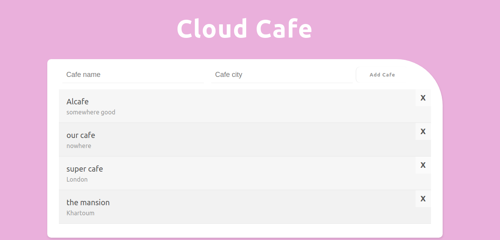

## Simple Add/remove Cafe app using firebase firestore

### Based on the net ninja tutorial on firestore but I used firebase v9 instead

#### What I learned:

1. Firebase basics.
2. Interacting with firestore.
3. Using firebase v9.
4. Add/Remove/Update data from the database.
5. Get live data by subscribing to snapshot.
6. Make specific queries on data and order them.

**Screenshot from the app** :

